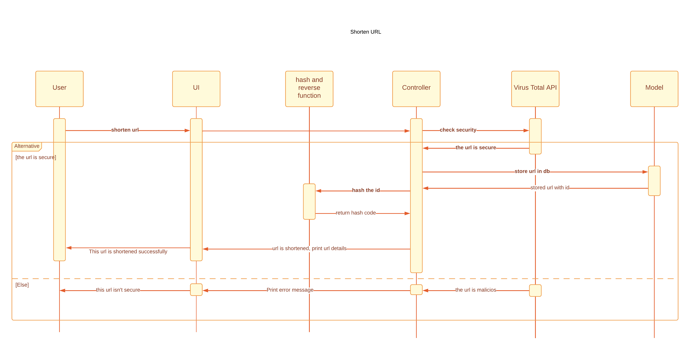

# Shortacadabra

**Shortacadabra** — сервис для безопасного сокращения ссылок.

## 🚀 Возможности
- Сокращение длинных ссылок в короткие
- Проверка ссылок на безопасность через VirusTotal
- Хранение и просмотр своих сокращённых ссылок
- Только зарегистрированные пользователи могут пользоваться сервисом
- Современный адаптивный интерфейс на Bootstrap 5

## 🛠️ Технологии
- **Python 3.x**
- **Django 4.0.5**
- **Bootstrap 5** (через CDN)
- **django-crispy-forms** и **crispy-bootstrap5**
- **python-decouple** (для переменных окружения)
- **requests** (для работы с внешними API)
- **SQLite** (по умолчанию) или **PostgreSQL** (для продакшена)

## 📦 Установка и запуск

1. **Клонируйте репозиторий:**
   ```bash
   git clone https://github.com/abdelwahabram/ShortSecure.git
   cd ShortSecure-masterpython manage.py makemigrations ss
   ```

2. **Создайте виртуальное окружение:**
   ```bash
   python -m venv venv
   venv\Scripts\activate   # для Windows
   ```

3. **Установите зависимости:**
   ```bash
   pip install -r requirements.txt
   ```

4. **Создайте файл .env в корне проекта:**
   ```env
   SECRET_KEY=your_django_secret_key
   api=your_virustotal_api_key
   ```

5. **Примените миграции:**
   ```bash
   python manage.py migrate
   ```

6. **Создайте суперпользователя (по желанию):**
   ```bash
   python manage.py createsuperuser
   ```

7. **Запустите сервер:**
   ```bash
   python manage.py runserver
   ```

8. **Откройте сайт:**
   Перейдите в браузере по адресу http://127.0.0.1:8000/

## 👤 Регистрация и вход
- Для использования сервиса необходимо зарегистрироваться.
- Гостям доступны только страницы регистрации и входа.

## 📁 Структура проекта
```
Shortacadabra/
├── Shortacadabra/         # Настройки Django (settings, urls, wsgi, asgi)
├── ss/                   # Основное приложение
│   ├── templates/
│   │   ├── registration/ # Шаблоны регистрации и входа
│   │   └── ss/           # Основные шаблоны сайта
│   ├── migrations/       # Миграции базы данных
│   ├── models.py         # Модели
│   ├── views.py          # Вьюхи
│   ├── forms.py          # Формы
│   ├── admin.py          # Админка
│   ├── urls.py           # URL-маршруты приложения
│   └── ...
├── manage.py             # Запуск Django
├── requirements.txt      # Зависимости
├── runtime.txt           # Версия Python для деплоя
├── Procfile              # Для запуска на Heroku
├── README.md             # Документация
└── docs/                 # Документация и диаграммы
```

## 🖼️ Скриншоты
> 
